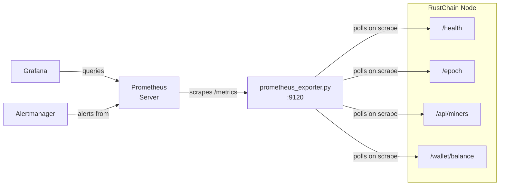

# Prometheus Metrics for RustChain

A standalone Prometheus exporter that polls your RustChain node's JSON APIs and re-exposes them as Prometheus-compatible metrics on `GET /metrics`.

**Bounty:** [#765 — Prometheus Metrics Exporter — Observable RustChain](https://github.com/RustChainOrg/rustchain-bounties/issues/765)

---

## Architecture



The exporter uses a **custom collector** — it fetches fresh data from the node on every Prometheus scrape.  No background threads, no stale data.

---

## Quick Start

### 1. Install

```bash
pip install -r scripts/requirements-metrics.txt
```

### 2. Run

```bash
python scripts/prometheus_exporter.py \
    --node-url https://50.28.86.131 \
    --port 9120 \
    --poll-timeout 15
```

### 3. Verify

```bash
curl http://localhost:9120/metrics
```

You should see output like:

```
# HELP rustchain_node_up Whether the RustChain node is reachable and healthy
# TYPE rustchain_node_up gauge
rustchain_node_up 1.0
# HELP rustchain_node_uptime_seconds Node uptime in seconds
# TYPE rustchain_node_uptime_seconds gauge
rustchain_node_uptime_seconds 97760.0
...
```

### 4. Docker (optional)

```bash
cd scripts
docker build -f Dockerfile.metrics -t rustchain-exporter .
docker run -d -p 9120:9120 rustchain-exporter --node-url https://50.28.86.131
```

---

## CLI Options

| Flag | Default | Description |
|---|---|---|
| `--node-url` | `https://50.28.86.131` | Base URL of the RustChain node |
| `--port` | `9120` | Port to serve `/metrics` on |
| `--poll-timeout` | `15` | HTTP timeout per API call (seconds) |
| `--tracked-wallets` | `""` | Comma-separated wallet IDs to track |
| `--verify-tls` | `false` | Verify TLS certs |
| `--log-level` | `INFO` | Logging level |

---

## Exported Metrics

### Node Health (from `/health`)

| Metric | Type | Description |
|---|---|---|
| `rustchain_node_up` | gauge | 1 if node healthy, 0 otherwise |
| `rustchain_node_uptime_seconds` | gauge | Node uptime |
| `rustchain_node_version_info{version="..."}` | gauge | Always 1, version in label |
| `rustchain_db_rw` | gauge | 1 if DB read-write, 0 if read-only |
| `rustchain_backup_age_hours` | gauge | Backup age in hours |
| `rustchain_tip_age_slots` | gauge | Tip age in slots (0 = synced) |

### Epoch (from `/epoch`)

| Metric | Type | Description |
|---|---|---|
| `rustchain_epoch_current` | gauge | Current epoch number |
| `rustchain_epoch_slot` | gauge | Current slot in epoch |
| `rustchain_epoch_blocks_per_epoch` | gauge | Blocks per epoch |
| `rustchain_epoch_enrolled_miners` | gauge | Enrolled miners count |
| `rustchain_epoch_pot_rtc` | gauge | Epoch reward pot (RTC) |

### Miners (from `/api/miners`)

| Metric | Type | Description |
|---|---|---|
| `rustchain_miners_active` | gauge | Active miner count |
| `rustchain_miners_total` | gauge | Total miners in API response |
| `rustchain_attestation_age_seconds{miner="..."}` | gauge | Per-miner attestation age |
| `rustchain_miner_entropy_score{miner="..."}` | gauge | Per-miner entropy score |
| `rustchain_miner_antiquity_multiplier{miner="..."}` | gauge | Per-miner antiquity multiplier |

### Wallets (from `/wallet/balance`)

| Metric | Type | Description |
|---|---|---|
| `rustchain_wallet_balance_rtc{wallet="..."}` | gauge | Wallet balance (RTC) |

### Internal

| Metric | Type | Description |
|---|---|---|
| `rustchain_api_request_duration_seconds` | histogram | Exporter poll latency |
| `rustchain_scrape_errors_total{endpoint="..."}` | counter | Failed polls per endpoint |

---

## Prometheus Setup

Add to your `prometheus.yml`:

```yaml
scrape_configs:
  - job_name: "rustchain"
    scrape_interval: 30s
    static_configs:
      - targets: ["localhost:9120"]
```

A complete example config is at [`docs/prometheus/prometheus.yml`](prometheus/prometheus.yml).

---

## Alert Rules

Import [`docs/prometheus/alert_rules.yml`](prometheus/alert_rules.yml) into your Prometheus `rule_files`:

| Alert | Condition | Severity |
|---|---|---|
| `RustChainNodeDown` | Node unreachable for 2m | critical |
| `RustChainDBReadOnly` | DB read-only for 1m | critical |
| `RustChainNoActiveMiners` | Zero miners for 5m | critical |
| `RustChainEpochStuck` | Epoch unchanged for 30m | warning |
| `RustChainBackupStale` | Backup > 6 hours old | warning |
| `RustChainHighAPILatency` | p95 latency > 2s for 5m | warning |

---

## Grafana Dashboard

Import [`docs/grafana/rustchain-dashboard.json`](grafana/rustchain-dashboard.json) via Grafana → Dashboards → Import.

**Panels included (10):**

1. Node Status (stat)
2. Node Uptime (stat)
3. Current Epoch (stat)
4. Epoch Progress (gauge)
5. Epoch Pot RTC (stat)
6. Enrolled Miners (stat)
7. Active Miners Over Time (timeseries)
8. API Latency p50/p95/p99 (timeseries)
9. Per-Miner Attestation Age (table)
10. Scrape Errors Rate (timeseries)

---

## Running Tests

```bash
python -m pytest tests/test_prometheus_metrics_exporter.py -v
```

All tests use mocked HTTP — no live node required.

---

## Troubleshooting

| Issue | Fix |
|---|---|
| `Connection refused` on `:9120` | Ensure the exporter is running |
| All metrics zero | Check `--node-url` is correct and node is reachable |
| TLS errors | Use `--verify-tls` only if node has valid certs (default: off) |
| Wallet metrics empty | Pass `--tracked-wallets wallet1,wallet2` |
| High scrape latency | Increase `--poll-timeout` or check node performance |
